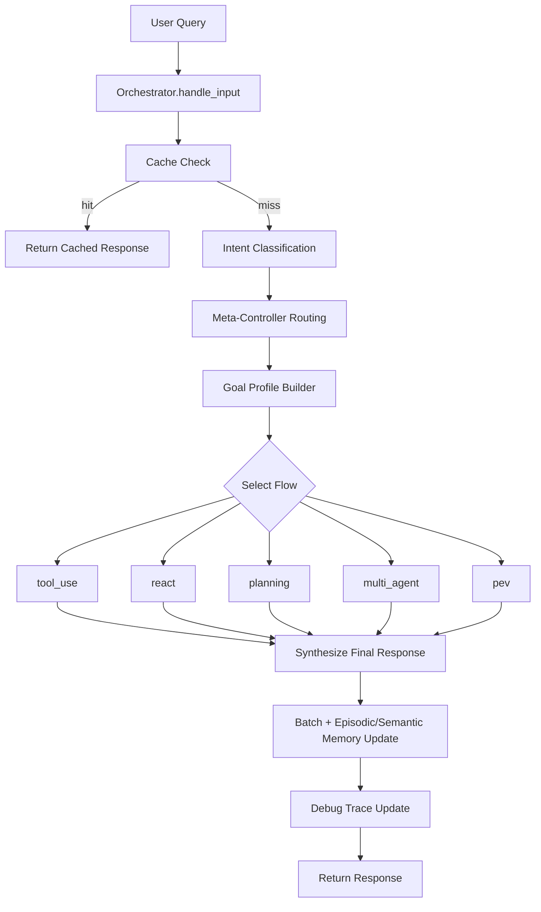
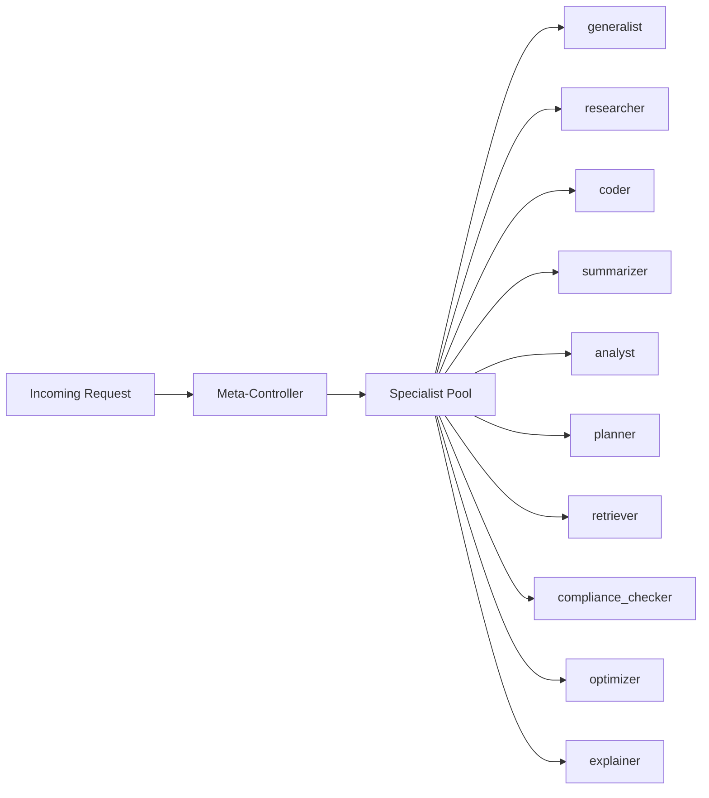
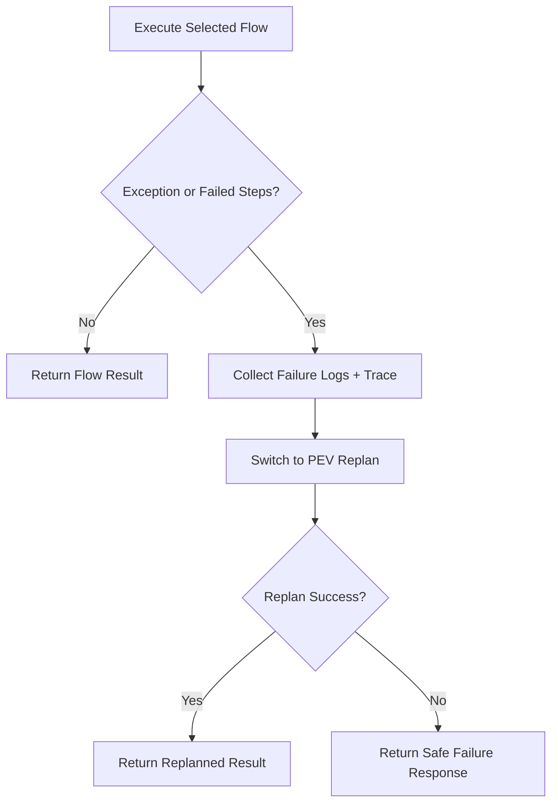

# AutoBot (Agentic Multi-Flow Orchestrator)

AutoBot is a local-first assistant that routes each user request through a **meta-controller** and then executes one of five agentic flows:

1. `tool_use`
2. `react`
3. `planning`
4. `multi_agent`
5. `pev` (Planner -> Executor -> Verifier)

The orchestrator also supports:

- 3 specialized local model lanes (`autobot_instruct`, `autobot_thinking`, `autobot_rag`)
- Tool integrations (`web_search`, `send_email`)
- Long-term + episodic + semantic memory
- Debug traces (chosen specialist, chosen flow, chosen models)
- Automatic replanning on flow failure

## What Was Added

This implementation now includes a **Meta-Controller layer** inspired by `arc-files/11_meta_controller.ipynb`.

The meta-controller:

- analyzes each request,
- chooses a specialist lane (`generalist`, `researcher`, `coder`, `summarizer`, `analyst`, `planner`, `retriever`, `compliance_checker`, `optimizer`, `explainer`),
- suggests a preferred flow,
- influences tool requirements and RAG usage,
- writes route decisions into debug trace.

## LangChain Optimization Layer

AutoBot now uses LangChain components where they are suitable for speed, structure, and reliability:

- `langchain-core`
  - prompt templating (`PromptTemplate`)
  - structured output parsing (`PydanticOutputParser`)
  - reusable tool definitions (`StructuredTool`)
  - callback-based observability
- `langchain-community`
  - BM25 retrieval reranking for memory fallback
  - local document loaders (PDF/CSV/HTML/TXT)
- `langchain-text-splitters`
  - chunking long local document text before retrieval
- `langchain`
  - conversation buffer memory integration
- `langgraph`
  - optional graph-based multi-agent execution path
- `langchain-experimental` / `langchain-guardrails`
  - optional advanced/guardrail ecosystem dependencies

When these packages are unavailable at runtime, AutoBot falls back to built-in logic and keeps serving requests.

Note:
- Some requested capabilities like `agents`, `chains`, `planning`, `react`, `schema`, `output-parsers`, `prompt`, `load`, `retrievers`, and `multi-agent` are implemented through the concrete modules above (`langchain-core`, `langchain-community`, `langgraph`, and `langchain`) rather than separate runtime packages.

## Core Runtime Files

- Entry point: `main.py`
- Orchestration: `core/orchestrator.py`
- Intent + Planner + LLM abstraction:
  - `core/intent_classifier.py`
  - `core/planner.py`
  - `core/llm_interface.py`
- Memory:
  - `memory/memory_manager.py`
  - `memory/rag_pipeline.py`
- Tools:
  - `tools/tool_registry.py`
  - `tools/web-search/search.py`
  - `tools/send-email/send-email.py`

Reference-only notebooks live in `arc-files/` and are not runtime modules.

## High-Level Architecture



## Meta-Controller Routing



### Specialist Intent

- `generalist`: chat, direct Q&A, simple assistant tasks.
- `researcher`: factual research, latest/current events, evidence-heavy requests.
- `coder`: code generation, debugging, refactoring, algorithm/programming tasks.
- `summarizer`: condenses long text/documents into concise summaries.
- `analyst`: interprets data and returns structured insights.
- `planner`: decomposes complex tasks into ordered steps.
- `retriever`: fetches relevant memory/vector-store context.
- `compliance_checker`: validates outputs against rules/safety constraints.
- `optimizer`: improves efficiency, latency, cost, or resource usage.
- `explainer`: provides step-by-step explanations.

## Flow Failure + Replan



## Memory Pipeline

```mermaid
flowchart LR
    U[User Input] --> ST[Short-Term Memory]
    U --> LT[Interaction Storage (SQLite)]
    LT --> ES[Episodic Memory]
    LT --> SM[Semantic Facts]
    Q[New Query] --> RET[Retrieve]
    RET --> RAG[RAG Context]
    RET --> ESR[Episodic Recall]
    RET --> SMR[Semantic Recall]
    RAG --> C[Combined Context]
    ESR --> C
    SMR --> C
```

## Installation

```bash
python -m venv .venv
.venv\Scripts\activate
pip install -r requirements.txt
```

## Run

```bash
python main.py
```

Then choose:

- `1` for text interface
- `2` for voice interface

## Configuration (`config/settings.yaml`)

Important sections:

- `assistant`: display name/version
- `memory`: sqlite + vector store paths
- `interfaces`: text/voice enable flags
- `tools.enabled`: tool availability flags
- `performance`: cache and memory batching
- `debug.enabled`: debug print + trace support
- `agentic`: flow tuning, meta-controller tuning, and langchain optimization toggles

### Example

```yaml
debug:
  enabled: true

agentic:
  react_max_iterations: 4
  pev_max_attempts: 3
  max_context_length: 32768
  max_tokens_hard_limit: 4096
  meta_controller:
    enabled: true
    temperature: 0.1
    max_tokens: 320
  langchain:
    enabled: true
    use_bm25_rerank: true
    use_local_doc_loader: true
    use_langgraph_multi_agent: true
    chunk_size: 900
    chunk_overlap: 120
```

## Input / Output Examples

### 1) General conversation

Input:

```text
Hello, can you help me plan my day?
```

Expected route:

- Specialist: `generalist`
- Flow: typically `react`

Output shape:

```text
Sure. Here's a simple plan for your day...
```

### 2) Research query

Input:

```text
Search latest AI regulation updates in the US and summarize key points.
```

Expected route:

- Specialist: `researcher`
- Flow: `tool_use` or `planning` (may escalate by complexity)
- Tool: `web_search`

Output shape:

```text
Here are the latest updates...
Sources considered: ...
```

### 3) Coding query

Input:

```text
Write a Python function to return the nth Fibonacci number.
```

Expected route:

- Specialist: `coder`
- Flow: `react` (simple) or `planning`/`pev` (complex)

Output shape:

```python
def fib(n: int) -> int:
    if n < 2:
        return n
    a, b = 0, 1
    for _ in range(2, n + 1):
        a, b = b, a + b
    return b
```

### 4) Email task

Input:

```text
Send email to alice@example.com with subject "Status" and body "Build is green".
```

Expected route:

- Tool involvement: `send_email`
- Missing fields trigger validation prompt before send.

Output shape:

```text
Email sent successfully (or validation message listing missing fields).
```

### 5) Local document retrieval with LangChain loaders

Programmatic call:

```python
response = await orchestrator.handle_input(
    "Summarize the attached reports and compare findings.",
    context={
        "local_documents": [
            "./memory/data/report_a.pdf",
            "./memory/data/report_b.csv",
        ]
    },
)
```

Expected behavior:

- local docs are loaded via langchain-community loaders,
- long text is split with langchain text splitters,
- retrieval context is BM25-reranked before synthesis.

## Debug / Trace

Each request can log:

- chosen flow
- chosen specialist
- models used
- route events and replan events

Runtime debug print example:

```text
[DEBUG] request=trace_... chosen_flow=planning chosen_complexity=medium chosen_specialist=researcher
[DEBUG] request=trace_... chosen_flow=planning chosen_specialist=researcher chosen_models=['autobot_instruct', 'autobot_rag']
```

Programmatic status endpoint-like call:

```python
status = await orchestrator.get_debug_status(limit=20)
print(status["active_request"])
print(status["recent_trace"])
```

## Prompt Test Matrix (Recommended)

Use these prompts to quickly verify routing:

1. `Hi there!`
2. `Search latest semiconductor market report and summarize.`
3. `Write Python code to parse CSV and group by date.`
4. `Create a comprehensive plan, execute it, and verify risks.`
5. `Send email to test@example.com saying deployment completed.`

Check:

- specialist chosen correctly,
- flow chosen matches complexity,
- tool usage appears when needed,
- replan triggers on forced failures.

## Notes

- `arc-files/` notebooks are design references, not runtime imports.
- `memory/ingestion_pipeline.py` is a standalone ingestion utility.
- Voice mode requires platform audio dependencies (`SpeechRecognition`, `pyaudio`, `pyttsx3`).
